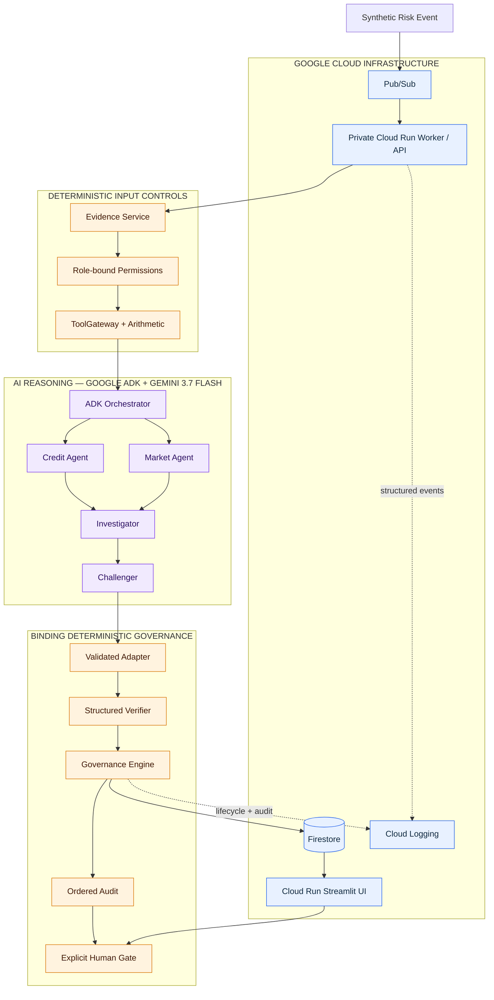

# Institutional Risk Agent Fleet

An autonomous, governed multi-agent system that investigates institutional portfolio-risk events
with Gemini and Google ADK, verifies material claims deterministically, and escalates consequential
decisions to a human.

Built for Google's **All Things Agentic Hackathon — Fortified Enterprise Fleet**.

> **Synthetic demonstration only.** All issuer, portfolio, market, financial, and source-document
> data in this repository is invented. This is not investment advice.

## Why this exists

Autonomous financial agents can gather evidence and propose recommendations, but institutional use
requires more than model confidence. Permissions must be scoped, calculations reproducible, claims
traceable to evidence, errors preserved for audit, and consequential decisions escalated to a human.

Institutional Risk Agent Fleet separates generative reasoning from institutional authority:

- Gemini investigates and proposes.
- Deterministic code controls permissions, tools, validation, verification, and lifecycle.
- A human remains the final authority when governance requires review.

## What happens in the demo

A synthetic ACME Corp credit event arrives against a **$75 million** portfolio exposure. Its spread
widens from **120bp to 210bp**—a **+90bp** move classified as **HIGH** severity.

The fleet investigates asynchronously. An upstream source reports FY2025 leverage at **4.1x**, while
the authoritative synthetic filing and deterministic leverage tool both establish **3.8x**. The
Verifier rejects `claim-001`, preserves it in history, and creates verified `claim-002` with
`supersedes_claim_id="claim-001"`.

Machine verification then passes, but the risk remains **RED** and governance returns
**HUMAN_REVIEW_REQUIRED**. No approval is inferred from model confidence or machine clearance.

## Architecture



The diagram's key boundary is deliberate: AI reasoning proposes claims, while ordinary typed Python
decides what can enter canonical state and what the institution can trust.

## Agent roles

- **Credit Agent:** analyzes issuer financial evidence and credit metrics.
- **Market Agent:** analyzes the spread shock and market context.
- **Investigator:** synthesizes proposals into a risk thesis and recommendation.
- **Challenger:** probes source conflicts, unsupported leaps, and alternative explanations.

These are the model-backed reasoning roles. Evidence retrieval, financial tools, permission checks,
claim validation, verification, governance, lifecycle transitions, audit sequencing, and human
decision enforcement are deterministic services—not additional LLM agents.

## Governance controls

- code-enforced, role-bound capabilities with visible denials;
- deterministic financial tools with input, output, unit, actor, and provenance records;
- strict structured model outputs and canonical reference validation;
- required evidence and tool lineage for material claims;
- a non-authoritative adversarial Challenger followed by a binding deterministic Verifier;
- numeric, unit, period, evidence-identity, tool, and premise verification;
- immutable-style claim history with explicit supersession;
- separate machine-verification, risk, governance, lifecycle, and human-review states;
- ordered application audit events plus structured cloud logs;
- transactional human decisions and idempotent Pub/Sub event processing.

The Credit Agent deliberately attempts portfolio access in the demo. Its role-bound gateway rejects
the request in code and records `permission_denied` in the audit trail.

## Google stack

- **Gemini 3.7 Flash on Vertex AI** for bounded reasoning;
- **Google ADK** for Credit and Market in parallel, followed by Investigator and Challenger;
- **Cloud Run** for the private worker/API and public judge UI;
- **Pub/Sub** for authenticated asynchronous event delivery;
- **Firestore** for persistent investigation, claim, decision, and idempotency state;
- **Cloud Logging** for structured infrastructure execution records.

## Quickstart — offline

Python 3.12 and [`uv`](https://docs.astral.sh/uv/) are required. Offline mode is deterministic and
requires no Google Cloud account or model credential.

```bash
uv sync --locked
uv run python -m institutional_risk_fleet.demo
```

To exercise the explicit human boundary:

```bash
uv run python -m institutional_risk_fleet.demo \
  --decision approve \
  --reviewer "A. Risk Officer" \
  --rationale "Synthetic evidence and corrected claim reviewed."
```

Launch the four-view judge interface locally:

```bash
uv run streamlit run app/streamlit_app.py
```

Select **Trigger Risk Event** once. Streamlit reruns reuse the authoritative in-memory investigation
and do not rerun the workflow. **Reset Demo** restores only the frozen synthetic ACME scenario.

## Gemini local mode

Choose one credential path. Never commit credentials.

Gemini API:

```bash
export GEMINI_API_KEY="your-key"
export GEMINI_MODEL="gemini-3.7-flash"
uv run python -m institutional_risk_fleet.demo --provider gemini
```

Vertex AI with Application Default Credentials:

```bash
export GOOGLE_GENAI_USE_VERTEXAI=true
export GOOGLE_CLOUD_PROJECT="your-project-id"
export GOOGLE_CLOUD_LOCATION="global"
export GEMINI_MODEL="gemini-3.7-flash"
uv run python -m institutional_risk_fleet.demo --provider gemini
```

Gemini retries are bounded. Deterministic fallback is disabled by default and is never silent; if
explicitly enabled, its use is recorded in model-call metadata and audit events.

## Google Cloud deployment

The deployed path uses authenticated Pub/Sub push to a private worker, Vertex AI through the worker
service identity, Firestore persistence, and a separate Streamlit service. Follow the parameterized,
step-by-step guide in [docs/cloud_deployment.md](docs/cloud_deployment.md).

## Tests

```bash
uv run pytest
uv run ruff check .
uv run pyright
```

The final submission gate is **66 passing tests**. Tests are credential-free and include a local
cloud-like Pub/Sub HTTP path, Firestore fakes, duplicate-delivery idempotency, model-output trust
boundaries, claim-history preservation, audit ordering, and concurrent human decisions.

## Synthetic data and safety

**All portfolio, issuer, market, financial, and source-document data used in the demo are
synthetic.** The frozen fixture is [data/synthetic/acme_scenario.json](data/synthetic/acme_scenario.json).

**The system investigates and recommends; it does not execute trades.** There is no trading or
recommendation-execution endpoint.

## Documentation

- [Architecture and authority boundaries](docs/architecture.md)
- [Frozen demo scenario](docs/demo_scenario.md)
- [Governance policy](docs/governance_policy.md)
- [Gemini and ADK integration](docs/model_integration.md)
- [Google Cloud deployment](docs/cloud_deployment.md)
- [Demo script](docs/demo_script.md)
- [Recording and rehearsal checklist](docs/demo_checklist.md)
- [Devpost submission draft](docs/devpost_submission.md)
- [Screenshot capture plan](docs/images/README.md)
- [Prior-work disclosure](docs/prior_work_disclosure.md)

## Prior work

This is a new hackathon implementation written for this repository. Earlier research repositories
informed ideas around typed state, verification, permissions, and auditability; no wholesale code
files were copied. See the transparent [prior-work disclosure](docs/prior_work_disclosure.md).

## Limitations

The demo intentionally covers one synthetic fixed-income scenario, uses no live market feeds, and
uses hackathon-scoped IAM rather than a full organization security program. Broader asset coverage,
evidence-policy generalization, and enterprise identity integrations remain future work after the
governance boundary is proven.
