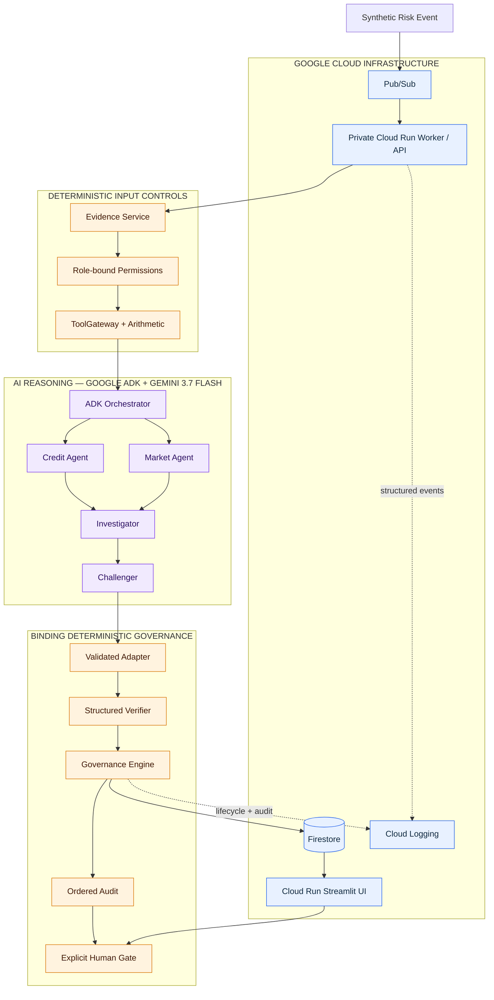

# Architecture and authority boundaries

Institutional Risk Agent Fleet is deliberately split into three layers: Google Cloud transports and
persists work, Google ADK and Gemini propose bounded reasoning artifacts, and deterministic Python
decides what the institution may trust or do.

## Runtime flow

1. The judge-facing Streamlit service asks the authenticated worker to publish the fixed synthetic
   event. The UI never runs the workflow or writes Firestore directly.
2. Pub/Sub delivers a minimal, versioned event to the private worker using authenticated push.
3. The worker acquires an idempotency lease and runs the same deterministic workflow used offline.
4. Evidence is registered under stable IDs. Role-bound gateways execute deterministic tools before
   reasoning and expose typed results—not unrestricted data access—to each role.
5. ADK runs Credit and Market in parallel, then Investigator and Challenger sequentially. Every role
   has a strict Pydantic output schema and no model-exposed tools.
6. A validating adapter rejects unknown evidence, tool, premise, or challenge-target IDs before any
   state mutation. Challenger output is advisory and cannot create verifier findings.
7. The Verifier compares values, units, periods, evidence identities, tool results, and premises.
   Deterministic governance then selects revision, readiness, or human review.
8. Firestore persists canonical state and stable-ID artifacts. The UI polls read models and records
   an explicit human decision through the authenticated worker API.

## Authority matrix

| Concern | AI reasoning | Deterministic code | Human |
| --- | --- | --- | --- |
| Analyze evidence and propose claims | Yes | Validates structure and references | Reviews result |
| Retrieve evidence or run financial tools | No direct access | Sole authority through role-bound gateways | — |
| Challenge claims | Proposes challenges | Validates targets; Challenger cannot change status | Reviews unresolved issues |
| Verify material claims | No | Sole authority over findings and supersession | Reviews verified history |
| Set risk, governance, and lifecycle state | No | Sole machine authority | Final consequential decision |
| Execute a trade | No | No endpoint exists | Outside system scope |

## Independent state dimensions

- `LifecycleStatus` describes where execution is.
- `GovernanceStatus` is `PENDING`, `REVISION_REQUIRED`, `READY`, or
  `HUMAN_REVIEW_REQUIRED`.
- `RiskClassification` is `GREEN`, `YELLOW`, or `RED`.
- `HumanReviewStatus` records whether review is required and the explicit human outcome.

A RED investigation can pass machine verification. That is the expected pre-human result for the
ACME scenario: the erroneous 4.1x claim is retained as rejected, the 3.8x correction supersedes it,
and governance still requires a person.

## Persistence, idempotency, and audit

`StateStore` isolates persistence from domain rules. `InMemoryStateStore` powers credential-free
offline execution; `FirestoreStateStore` persists a canonical snapshot plus independently queryable
claim, decision, and audit documents. Transactions serialize event leases and human decisions, but
do not define lifecycle or governance policy.

Duplicate Pub/Sub delivery reuses the completed investigation or acknowledges an active lease. The
first valid terminal human decision wins; a later conflicting decision is rejected and audited.
Application audit sequence numbers remain contiguous, while structured Cloud Logging provides the
infrastructure execution record. Credentials and model hidden reasoning are never persisted.
