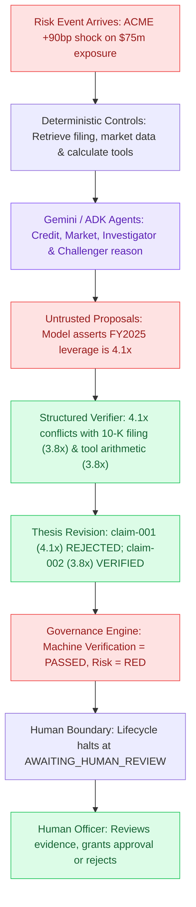

# Chapter 00 — Institutional Risk Agent Fleet in 10 Minutes

## The Story: A Market Shock at 08:30 AM

Imagine you are the Chief Risk Officer at an institutional asset management firm. Your portfolio holds **\$75,000,000 USD** in fixed-income debt issued by **Acme Corp**.

At 08:30 AM, secondary credit markets open with extreme volatility. Acme Corp's benchmark 5-year credit spread spikes:

```text
Previous spread: 120 bps (basis points)
Current spread:  210 bps
Spread shock:    +90 bps (+0.90%)
Severity:        HIGH
```

A +90 bps spread widening on \$75m of credit exposure with a 4.2-year duration implies an immediate first-order mark-to-market loss of approximately **-\$2,835,000 USD**.

An automated market feed fires a risk event into your firm's system. What happens next?

---

## The Workflow in One Diagram



Here is what occurs step by step:
1. **Event Ingestion**: Pub/Sub receives the event and invokes the Cloud Run backend with transactional idempotency.
2. **Deterministic Tool Execution**: Authoritative tools calculate leverage ratio (`380 / 100 = 3.8x`) and spread P&L (`-$2.835m`).
3. **AI Reasoning**: Gemini 3.7 Flash agents orchestrated with Google ADK analyze the credit impact.
4. **The Fault**: An automated upstream enrichment feed claims Acme's leverage is `4.1x`. The model incorporates this into `claim-001`.
5. **The Rejection**: The deterministic `StructuredVerifier` checks `claim-001` against the authoritative audited 10-K filing (`3.8x`) and rejects it.
6. **The Correction**: The system generates revised `claim-002` (3.8x), preserving the rejected `claim-001` in the permanent audit trail with `supersedes_claim_id="claim-001"`.
7. **The Human Gate**: Even though arithmetic verification now passes, the magnitude of the \$75m risk classified as **RED** forces governance to require human approval.

---

## The Three-Layer Mental Model

To understand this codebase, never treat it as just "an LLM app". It is structured in three distinct architectural layers:

```text
┌────────────────────────────────────────────────────────┐
│ 1. AI REASONING (Google ADK + Gemini 3.7 Flash)       │
│    • Credit Agent, Market Agent, Investigator,         │
│      Challenger                                        │
│    • Role: Hypothesize, correlate, draft proposals     │
└───────────────────────────┬────────────────────────────┘
                            │ Proposes claims (Untrusted)
                            ▼
┌────────────────────────────────────────────────────────┐
│ 2. DETERMINISTIC AUTHORITY (Typed Python)              │
│    • Permissions & ToolGateways                        │
│    • Structured Verification & Arithmetic Tools        │
│    • Governance Policy & Lifecycle State Machines      │
│    • Role: Decides what is true, valid, and permitted  │
└───────────────────────────┬────────────────────────────┘
                            │ Persists trusted state
                            ▼
┌────────────────────────────────────────────────────────┐
│ 3. GOOGLE CLOUD INFRASTRUCTURE                         │
│    • Cloud Pub/Sub (Asynchronous Ingestion)            │
│    • Private Cloud Run (Worker / API Execution)        │
│    • Cloud Firestore (Canonical Root & Subcollections) │
│    • Cloud Run Streamlit (Judge / Operator Interface)  │
└────────────────────────────────────────────────────────┘
```

### The Institutional Analogy

* **Pub/Sub** is the **doorbell**: It alerts the organization that a market event occurred, guaranteeing reliable delivery.
* **Cloud Run** is the **office building**: The secure, isolated environment where execution occurs.
* **Firestore** is the **filing cabinet**: The tamper-evident, permanent storage of records.
* **Gemini Agents** are the **junior analysts**: Fast, creative, capable of synthesis, but not legally authorized to commit capital or finalize facts.
* **Deterministic Governance** is the **compliance & risk department**: Checks every number against audited sources, enforces permissions, and logs every step.
* **Human Reviewer** is the **Chief Risk Officer**: The sole legal authority who makes the final call when portfolio risk is RED.

---

## Fast Hands-On: Run the Pipeline Locally

Run the workflow in offline mode right now from your terminal:

```bash
uv run python -m institutional_risk_fleet.demo
```

You will see the lifecycle transition through:
`CREATED` → `INVESTIGATING` → `VERIFYING` → `REVISING` → `VERIFYING` → `AWAITING_HUMAN_REVIEW`

Notice that the CLI stops and tells you that the investigation is awaiting a human decision!

Now simulate a human decision:

```bash
uv run python -m institutional_risk_fleet.demo \
  --decision approve \
  --reviewer "Chief Risk Officer" \
  --rationale "Reviewed corrected 3.8x filing leverage and market spread move."
```

---

## Check Your Understanding

1. **What can Gemini decide in this system?**
   * *Answer*: Gemini can propose hypotheses, extract perspectives, suggest material claims, and draft reasoning summaries.
2. **What can Gemini NOT decide?**
   * *Answer*: Gemini cannot authorize financial tool execution outside permissions, cannot override authoritative filings, cannot alter canonical state directly, and cannot approve a high-risk portfolio decision.
3. **Why is `HUMAN_REVIEW_REQUIRED` a governance status rather than a model prediction?**
   * *Answer*: Because regulatory and institutional policies mandate that high-severity events ($75m exposure, RED classification) require accountable human sign-off regardless of how confident the AI model claims to be.

---

## Code-Reading Exercise

Open [`src/institutional_risk_fleet/workflow.py`](file:///Users/xq/Documents/GitHub/institutional-risk-agent-fleet/src/institutional_risk_fleet/workflow.py#L90-L210) and find:
1. Where `self.reasoning_provider.run(...)` is invoked.
2. Where `ReasoningStateAdapter` validates the model output before canonical state is mutated.
3. Where `StructuredVerifier` evaluates the claims in Round 1 and Round 2.

Next: [Chapter 01 — The ACME Risk Event →](01_the_acme_risk_event.md)
