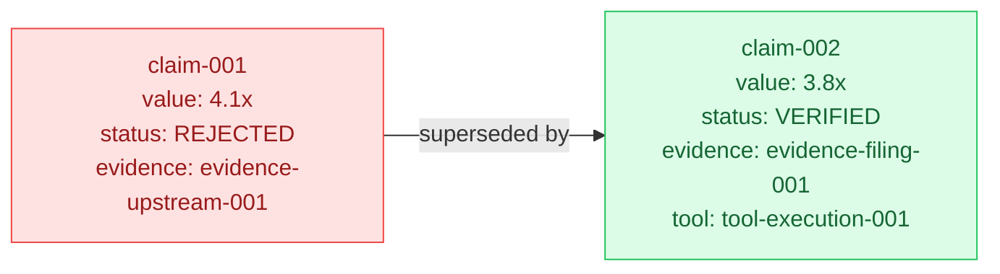
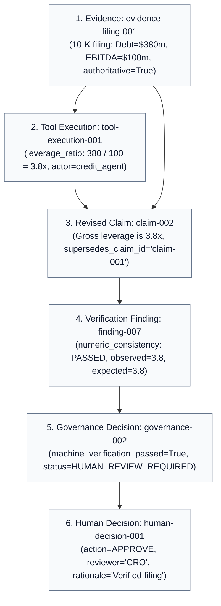

# Chapter 02 — Domain State and Provenance

## Why Provenance Requires Immutable Claim History

In typical Python CRUD applications, updating a record means mutating it in place:

```python
# ANTI-PATTERN IN INSTITUTIONAL RISK:
claim = db.get("claim-001")
claim.value = 3.8  # Overwriting 4.1 destroyed the history!
db.save(claim)
```

Why is in-place mutation catastrophic in risk management?
1. **Loss of Auditability**: Regulators and auditors can no longer see *why* an initial automated decision was made based on 4.1x.
2. **Untraceable Verification**: You cannot prove that a verification tool caught a real discrepancy and forced a revision.
3. **Broken Lineage**: If downstream models or reports cited the earlier hypothesis, changing the value under their feet creates silent state corruption.

Instead, the fleet enforces **append-only lineage and explicit supersession**:

```python
# THE AUDITABLE PATTERN:
# claim-001 remains in state with status=REJECTED
# claim-002 is created with status=VERIFIED and supersedes_claim_id="claim-001"
```



---

## The Primary Domain Models

All domain objects in [`src/institutional_risk_fleet/domain.py`](file:///Users/xq/Documents/GitHub/institutional-risk-agent-fleet/src/institutional_risk_fleet/domain.py) are immutable Pydantic models (`FrozenModel`):

| Domain Object | Purpose | Example ID |
| :--- | :--- | :--- |
| **`RiskEvent`** | The trigger payload containing issuer, spread move, and severity | `risk-event-acme-001` |
| **`Investigation`** | The canonical root state holding all tasks, claims, evidence, and audit logs | `investigation-acme-001` |
| **`Evidence`** | A registered data artifact (filing, market snapshot, feed) | `evidence-filing-001` |
| **`ToolExecution`** | A deterministic calculation execution with recorded inputs, output, and actor | `tool-execution-001` |
| **`Claim`** | A typed assertion (factual, calculated, inference, recommendation) with explicit lineage | `claim-001`, `claim-002` |
| **`Thesis`** | The synthesis of active claims into primary/alternative hypotheses | `thesis-001`, `thesis-002` |
| **`Challenge`** | An adversarial query or warning raised by the Challenger agent | `challenge-001` |
| **`VerificationFinding`** | The formal pass/fail evaluation of a claim by the deterministic Verifier | `finding-001` |
| **`GovernanceDecision`** | Policy clearance evaluating machine pass vs. human review mandates | `governance-001` |
| **`HumanDecision`** | A legally binding human action (`APPROVE`, `REJECT`, `MORE_INVESTIGATION`) | `human-decision-001` |
| **`AuditEvent`** | A monotonically sequenced, tamper-evident audit record | Sequences `1..N` |

---

## Tracing an Object Lineage Chain

Follow how an authoritative fact flows through the system to become an institutional decision:



Look at how `Claim` enforces this lineage in code ([`src/institutional_risk_fleet/domain.py`](file:///Users/xq/Documents/GitHub/institutional-risk-agent-fleet/src/institutional_risk_fleet/domain.py#L194-L225)):

```python
class Claim(FrozenModel):
    id: str
    author: Role
    claim_type: ClaimType
    text: str
    material: bool = True
    metric: str | None = None
    value: float | str | None = None
    unit: str | None = None
    period: str | None = None
    evidence_ids: tuple[str, ...] = ()
    tool_execution_ids: tuple[str, ...] = ()
    premise_claim_ids: tuple[str, ...] = ()
    confidence: float = Field(ge=0, le=1)
    status: ClaimStatus = ClaimStatus.ADOPTED
    supersedes_claim_id: str | None = None

    @model_validator(mode="after")
    def enforce_lineage(self) -> Claim:
        if self.material and self.claim_type == ClaimType.FACTUAL and not self.evidence_ids:
            raise ValueError("material factual claims require evidence lineage")
        if self.claim_type == ClaimType.CALCULATED and not self.tool_execution_ids:
            raise ValueError("calculated claims require successful tool lineage")
        if self.claim_type in {ClaimType.INFERENCE, ClaimType.RECOMMENDATION} and not self.premise_claim_ids:
            raise ValueError("inference and recommendation claims require premise claims")
        return self
```

---

## Check Your Understanding

1. **If a claim is corrected, why shouldn't its original record disappear?**
   * *Answer*: In risk and compliance systems, the historical record of what was originally believed (and why it was rejected) is vital for auditing, regression analysis, and legal accountability.
2. **What prevents a calculated claim from being created without a tool execution?**
   * *Answer*: Pydantic's `model_validator` on `Claim` executes at runtime and throws a `ValueError` if `claim_type == ClaimType.CALCULATED` but `tool_execution_ids` is empty.
3. **What is the difference between an `AuditEvent` and a `GovernanceDecision`?**
   * *Answer*: An `AuditEvent` is an immutable log entry recording any state transition or action (e.g., tool requested, task created). A `GovernanceDecision` is an explicit evaluation of whether the investigation meets policy rules.

---

## Code-Reading Exercise

Open [`src/institutional_risk_fleet/audit.py`](file:///Users/xq/Documents/GitHub/institutional-risk-agent-fleet/src/institutional_risk_fleet/audit.py#L20-L50) and inspect:
* The `AuditLog.append(...)` method.
* `assert_coherent_audit(investigation)`: Notice how it strictly validates that audit sequences are strictly monotonically increasing (`1, 2, 3...`) without gaps or duplicated indices.

---

## Optional Experiment

In python interactive shell:

```python
from institutional_risk_fleet.domain import Claim, ClaimType, Role

# Try creating a calculated claim without a tool execution ID:
try:
    c = Claim(
        id="bad-claim",
        author=Role.CREDIT,
        claim_type=ClaimType.CALCULATED,
        text="Leverage is 3.8x",
        value=3.8,
        confidence=1.0
    )
except ValueError as e:
    print("Caught expected validation error:", e)
```

Next: [Chapter 03 — Permissions and Deterministic Tools →](03_permissions_and_deterministic_tools.md)
