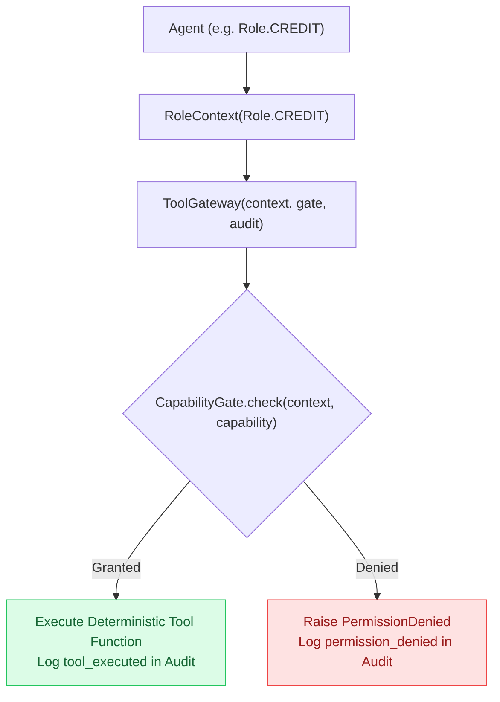

# Chapter 03 — Permissions and Deterministic Tools

## Why Not Just Prompt the Model What Tools It May Use?

A common pattern in basic agent frameworks is to list permissions inside the system prompt:

> *"You are the Credit Agent. You are NOT allowed to inspect other portfolio positions or trade assets. Please only call financial ratio tools."*

Why is prompt-based security completely inadequate for enterprise finance?
1. **Prompt Injections & Jailbreaks**: An adversary or unexpected data payload can instruct the LLM to ignore prior instructions and execute restricted tools.
2. **Hallucinated Authorization**: LLMs are probabilistic text predictors. They have no cryptographically verifiable identity or security perimeter.
3. **No Non-Repudiation**: If a model executes a tool it shouldn't have, you cannot prove whether the model misbehaved or whether the prompt was ambiguous.

> [!IMPORTANT]
> **Permissions must be enforced deterministically in code, not politely requested in natural language.**

---

## The Permission Architecture

The repository implements a three-part permission gate in [`src/institutional_risk_fleet/permissions.py`](file:///Users/xq/Documents/GitHub/institutional-risk-agent-fleet/src/institutional_risk_fleet/permissions.py):



Let's look at the actual role-capability matrix in [`src/institutional_risk_fleet/permissions.py`](file:///Users/xq/Documents/GitHub/institutional-risk-agent-fleet/src/institutional_risk_fleet/permissions.py#L35-L65):

```python
ROLE_CAPABILITIES: dict[Role, frozenset[Capability]] = {
    Role.CREDIT: frozenset({
        Capability.READ_ISSUER_FINANCIALS,
        Capability.EXECUTE_FINANCIAL_TOOLS,
        Capability.PROPOSE_CLAIMS,
    }),
    Role.MARKET: frozenset({
        Capability.READ_MARKET_HISTORY,
        Capability.READ_COMPARABLES,
        Capability.EXECUTE_MARKET_TOOLS,
        Capability.PROPOSE_CLAIMS,
    }),
    Role.INVESTIGATOR: frozenset({
        Capability.READ_ARTIFACTS,
        Capability.READ_PORTFOLIO_POSITIONS,
        Capability.EXECUTE_PORTFOLIO_TOOLS,
        Capability.CONSTRUCT_THESIS,
        Capability.PROPOSE_CLAIMS,
    }),
    Role.VERIFIER: frozenset({
        Capability.READ_ARTIFACTS,
        Capability.EXECUTE_VERIFICATION_TOOLS,
        Capability.CREATE_FINDING,
    }),
    Role.HUMAN: frozenset({
        Capability.READ_ARTIFACTS,
        Capability.RECORD_HUMAN_DECISION,
    }),
}
```

Notice:
* The **Credit Agent** can inspect financial statements and run leverage ratios, but has **NO** access to other portfolio positions.
* The **Investigator** can view total portfolio positions to calculate aggregate dollar loss.
* The **Human** is the only role with `Capability.RECORD_HUMAN_DECISION`.

---

## Tracing the Audited Credit Agent Denial

In the demo, the Credit Agent attempts to invoke the `portfolio_exposure` tool. Let's trace what happens in [`src/institutional_risk_fleet/workflow.py`](file:///Users/xq/Documents/GitHub/institutional-risk-agent-fleet/src/institutional_risk_fleet/workflow.py#L342-L365):

```python
def _run_credit_work(self, investigation: Investigation, scenario: FrozenScenario):
    context = RoleContext(Role.CREDIT)
    self.gate.require(context, Capability.READ_ISSUER_FINANCIALS, investigation)
    gateway = ToolGateway(context, self.gate, self.audit)
    
    # 1. Deliberate unauthorized attempt:
    with suppress(PermissionDenied):
        gateway.execute(
            investigation,
            "portfolio_exposure",
            {"position_market_values_usd": [p.market_value_usd for p in scenario.positions]},
        )
        
    # 2. Authorized leverage ratio calculation:
    execution = gateway.execute(
        investigation,
        "leverage_ratio",
        {
            "debt_usd_millions": scenario.financials.debt_usd_millions,
            "ebitda_usd_millions": scenario.financials.ebitda_usd_millions,
        },
    )
    return execution
```

When `gateway.execute("portfolio_exposure", ...)` runs under `Role.CREDIT`:
1. `ToolGateway` asks `CapabilityGate` if `Role.CREDIT` holds `Capability.READ_PORTFOLIO_POSITIONS`.
2. `CapabilityGate` checks the role matrix, discovers `Role.CREDIT` does NOT have it.
3. `CapabilityGate` appends a `permission_denied` event to the `investigation.audit_events`.
4. `CapabilityGate` raises `PermissionDenied("credit_agent is not granted read_portfolio_positions")`.
5. The workflow catches the exception, ensuring the security violation is logged without crashing the entire service.

---

## Deterministic Tools in `tools.py`

Look at the financial tools in [`src/institutional_risk_fleet/tools.py`](file:///Users/xq/Documents/GitHub/institutional-risk-agent-fleet/src/institutional_risk_fleet/tools.py):

```python
def leverage_ratio(debt_usd_millions: float, ebitda_usd_millions: float) -> float:
    if ebitda_usd_millions <= 0:
        raise ValueError("ebitda must be positive")
    return round(debt_usd_millions / ebitda_usd_millions, 4)


def spread_move(previous_spread_bps: float, current_spread_bps: float) -> float:
    return round(current_spread_bps - previous_spread_bps, 4)


def duration_spread_pnl(market_value_usd: float, spread_duration: float, spread_move_bps: float) -> float:
    spread_delta_decimal = spread_move_bps / 10_000.0
    return round(-market_value_usd * spread_duration * spread_delta_delta_decimal, 2)
```

Every execution produces an immutable `ToolExecution` record containing:
* `id`: e.g. `tool-execution-001`
* `tool_name`: `"leverage_ratio"`
* `actor`: `Role.CREDIT`
* `inputs`: `{"debt_usd_millions": 380.0, "ebitda_usd_millions": 100.0}`
* `output`: `3.8`
* `units`: `"x"`
* `provenance`: `"deterministic_python_math"`
* `successful`: `True`

---

## Check Your Understanding

1. **Why is it acceptable for Gemini to interpret a leverage ratio, but not to be the authoritative calculator of that ratio?**
   * *Answer*: LLMs are probabilistic next-token generators that can make arithmetic rounding mistakes or miscalculate divisions. Deterministic CPU arithmetic guarantees exact, reproducible calculation. The LLM's strength is qualitative interpretation ("what does 3.8x leverage imply for refinancing risk?").
2. **If an unauthorized tool call is attempted, why must it be appended to the audit log before returning?**
   * *Answer*: Security audits require visibility into attempted policy violations to detect malfunctioning agents, prompt injection attempts, or permission misconfigurations.

---

## Code-Reading Exercise

Open [`src/institutional_risk_fleet/permissions.py`](file:///Users/xq/Documents/GitHub/institutional-risk-agent-fleet/src/institutional_risk_fleet/permissions.py#L90-L130) and inspect:
* `CapabilityGate.require(...)`: Notice how it calls `audit.append(investigation, EventType.PERMISSION_DENIED, ...)` before raising `PermissionDenied`.

---

## Optional Experiment

Run pytest to verify the permission boundary test suite:

```bash
uv run pytest tests/test_tools_and_permissions.py
```

Next: [Chapter 04 — Reasoning Providers →](04_reasoning_providers.md)
