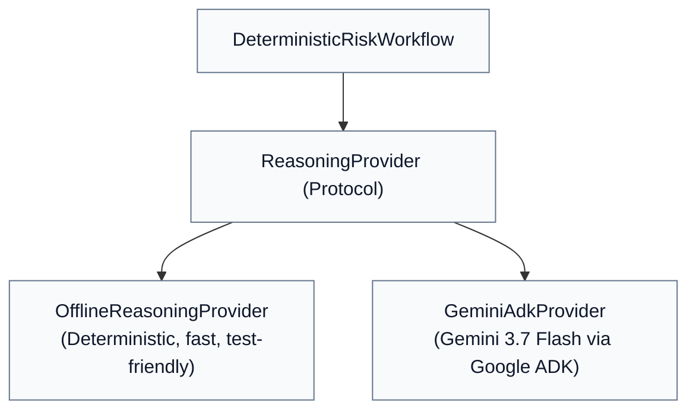

# Chapter 04 — Reasoning Providers

## Why Pluggable Reasoning Providers?

A key architectural smell in AI software is tight coupling to a remote LLM API. When an application can only run against live OpenAI or Vertex AI endpoints:
* Automated unit tests become slow, flaky, costly, and dependent on network connectivity.
* CI/CD pipelines require sensitive API keys and GCP project bindings.
* Debugging state transitions or governance policies becomes frustrating due to LLM nondeterminism.

To solve this, the fleet introduces the `ReasoningProvider` protocol abstraction in [`src/institutional_risk_fleet/reasoning.py`](file:///Users/xq/Documents/GitHub/institutional-risk-agent-fleet/src/institutional_risk_fleet/reasoning.py):



> [!IMPORTANT]
> **The rest of the system (permissions, tools, verification, governance, storage, UI) does not care which provider produced the proposals.** Both providers emit the exact same typed `ProviderOutcome` data structure.

---

## The Provider Protocol & Data Bundle

Look at how `ReasoningProvider` is defined in [`src/institutional_risk_fleet/reasoning.py`](file:///Users/xq/Documents/GitHub/institutional-risk-agent-fleet/src/institutional_risk_fleet/reasoning.py#L95-L125):

```python
class ReasoningProvider(Protocol):
    name: str
    model_id: str | None

    def run(
        self, context: ReasoningContext, observer: ModelObserver | None = None
    ) -> ProviderOutcome: ...
```

The output of either provider is a `ProviderOutcome` containing a typed `ReasoningBundle`:

```python
class ReasoningBundle(ReasoningModel):
    credit: CreditAnalysis
    market: MarketAnalysis
    investigation: InvestigationSynthesis
    challenger: ChallengeOutput


class ProviderOutcome(ReasoningModel):
    bundle: ReasoningBundle
    provider: str
    model_id: str | None
    model_calls: tuple[ModelCallRecord, ...] = ()
    fallback_used: bool = False
```

---

## The Two Providers

### 1. `OfflineReasoningProvider`
* **Purpose**: Deterministic local testing, instant CI runs, reproducible bug reproduction.
* **Mechanism**: Generates fixed, semantically rich synthetic proposals without network calls.
* **Dependencies**: Zero external APIs, zero keys.

### 2. `GeminiAdkProvider`
* **Purpose**: Production live reasoning on Vertex AI or Google AI Studio.
* **Mechanism**: Orchestrates 4 Gemini 3.7 Flash agents using the Google Agent Development Kit (ADK) with Pydantic JSON schemas.
* **Observability**: Captures prompt token counts, candidate token counts, latency in milliseconds, request IDs, and prompt versions for every model call.

---

## Resilient Execution & The No-Silent-Fallback Rule

In [`src/institutional_risk_fleet/adk_provider.py`](file:///Users/xq/Documents/GitHub/institutional-risk-agent-fleet/src/institutional_risk_fleet/adk_provider.py#L268-L350), the fleet wraps live execution with `ResilientReasoningProvider`:

```python
class ResilientReasoningProvider:
    """Bound retries and make deterministic fallback an explicit, observable choice."""
    def __init__(self, primary: ReasoningProvider, *, max_retries: int, fallback: OfflineReasoningProvider | None = None):
        self.primary = primary
        self.max_retries = max(0, max_retries)
        self.fallback = fallback
```

### The Institutional Policy on Fallbacks:
* In production, `RISK_FLEET_DETERMINISTIC_FALLBACK=false` by default.
* If a model fails or times out, the system **must not silently pretend it ran Gemini**.
* If a fallback is explicitly enabled for demonstration resilience, the `ProviderOutcome.fallback_used` flag is set to `True`, and an audited `EventType.MODEL_FALLBACK_USED` event is recorded in the permanent timeline.

---

## Check Your Understanding

1. **If Gemini becomes completely unavailable (e.g. 503 Outage or Network Failure), which parts of the system still remain trustworthy?**
   * *Answer*: All deterministic components remain completely trustworthy: retrieved evidence, financial arithmetic calculations, permission enforcement, existing verification findings, and governance rules. The workflow will safely halt at `AWAITING_HUMAN_REVIEW` with an operational escalation.
2. **Why is silent fallback dangerous in institutional risk?**
   * *Answer*: Silent fallback tricks operators into believing that a state-of-the-art model performed qualitative synthesis when in reality static fallback code ran. Every fallback must be logged and clearly surfaced in the UI.

---

## Code-Reading Exercise

Open [`src/institutional_risk_fleet/adk_provider.py`](file:///Users/xq/Documents/GitHub/institutional-risk-agent-fleet/src/institutional_risk_fleet/adk_provider.py#L400-L430) and inspect `_records(...)`:
* See how it constructs `ModelCallRecord` with `latency_ms`, `input_tokens`, `output_tokens`, and `validation_status`.

---

## Optional Experiment

Run the test suite that compares the offline provider contract against the Gemini schema models:

```bash
uv run pytest tests/test_milestone3_reasoning.py
```

Next: [Chapter 05 — Google ADK Agent Workflow →](05_google_adk_agent_workflow.md)
