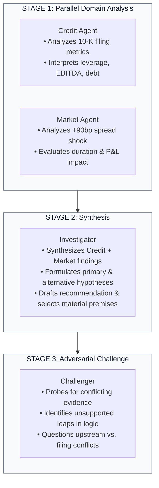

# Chapter 05 — Google ADK Agent Workflow

## What is an "Agent" in this Architecture?

In distributed systems, engineers often equate an "agent" with a container, a microservice, or a separate server.

In the Google Agent Development Kit (ADK) and this codebase:

> **An ADK "Agent" is a structured reasoning role, NOT an infrastructure microservice.**

Deploying each agent role as an independent Cloud Run microservice would introduce network latency, distributed state synchronization overhead, and complex retry semantics—without adding any architectural security or reliability benefits. All 4 reasoning roles execute within a single coordinated ADK pipeline.

---

## The Four Reasoning Roles



### Why this sequence?
1. **Parallel Analysis (Credit + Market)**: Credit analysis (balance sheet solvency) and Market analysis (spread pricing and liquidity) are independent domain perspectives on the same risk event. They run concurrently via `ParallelAgent`.
2. **Synthesis (Investigator)**: The Investigator must wait for both domain perspectives to complete before synthesizing them into an overarching risk thesis.
3. **Adversarial Challenge (Challenger)**: The Challenger cannot operate in a vacuum; its job is to attack the specific claims and thesis produced by the Investigator.

---

## Building the ADK Pipeline in Code

Inspect `build_adk_pipeline` in [`src/institutional_risk_fleet/adk_provider.py`](file:///Users/xq/Documents/GitHub/institutional-risk-agent-fleet/src/institutional_risk_fleet/adk_provider.py#L79-L115):

```python
from google.adk.agents import Agent, ParallelAgent, SequentialAgent
from google.adk.models import Gemini

def build_adk_pipeline(model_id: str) -> SequentialAgent:
    model = Gemini(model=model_id)
    
    credit = Agent(
        name=Role.CREDIT.value,
        model=model,
        instruction=_prompt(Role.CREDIT),
        output_schema=CreditAnalysis,
        output_key="credit_analysis",
    )
    market = Agent(
        name=Role.MARKET.value,
        model=model,
        instruction=_prompt(Role.MARKET),
        output_schema=MarketAnalysis,
        output_key="market_analysis",
    )
    investigator = Agent(
        name=Role.INVESTIGATOR.value,
        model=model,
        instruction=_prompt(Role.INVESTIGATOR),
        output_schema=InvestigationSynthesis,
        output_key="investigation_synthesis",
    )
    challenger = Agent(
        name=Role.CHALLENGER.value,
        model=model,
        instruction=_prompt(Role.CHALLENGER),
        output_schema=ChallengeOutput,
        output_key="challenge_output",
    )

    parallel = ParallelAgent(name="credit_market_parallel", sub_agents=[credit, market])
    return SequentialAgent(
        name="institutional_risk_reasoning",
        sub_agents=[parallel, investigator, challenger],
    )
```

Notice three key design patterns:
1. **Strong Output Schemas**: Every agent is bound to a strict Pydantic model (`CreditAnalysis`, `MarketAnalysis`, `InvestigationSynthesis`, `ChallengeOutput`). Gemini is forced to emit structured JSON adhering to these schemas.
2. **Context Sharing via Session**: Agents read prior outputs from the shared ADK session state (`credit_analysis`, `market_analysis`).
3. **Session State $\neq$ Authoritative Application State**: The ADK session is an ephemeral working scratchpad for the LLMs. Its contents are **untrusted** until validated by the `ReasoningStateAdapter`.

---

## The Role Prompts

Inspect the Markdown prompts located in [`src/institutional_risk_fleet/prompts/`](file:///Users/xq/Documents/GitHub/institutional-risk-agent-fleet/src/institutional_risk_fleet/prompts/):
* `credit_agent.md`: Instructs the model to extract gross debt, EBITDA, cash, and compare authoritative filing data with upstream feeds.
* `market_agent.md`: Instructs the model to evaluate the +90bp move against peer spreads and duration P&L.
* `investigator.md`: Instructs the model to synthesize the thesis and select premise proposal IDs for its recommendation.
* `challenger.md`: Instructs the model to specifically hunt for conflicts between evidence items (such as the 4.1x upstream metric vs. 3.8x filing metric).

---

## Check Your Understanding

1. **Why is the Challenger agent non-authoritative?**
   * *Answer*: The Challenger is an LLM role designed to generate hypotheses about potential flaws. It does not have the authority to unilaterally reject claims or alter the investigation's state. Its challenges are reviewed alongside claims by the deterministic `StructuredVerifier`.
2. **Why would deploying Credit and Market as separate Cloud Run services add complexity without improving the demo?**
   * *Answer*: Splitting them into separate microservices introduces network serialization overhead, inter-service auth credentials, and distributed transaction challenges, while providing zero additional security over in-process memory isolation for stateless LLM calls.

---

## Code-Reading Exercise

Open [`src/institutional_risk_fleet/prompts/challenger.md`](file:///Users/xq/Documents/GitHub/institutional-risk-agent-fleet/src/institutional_risk_fleet/prompts/challenger.md) and read:
* How the Challenger is explicitly prompted to search for contradictions between authoritative filing evidence and non-authoritative upstream enrichment.

---

## Optional Experiment

Inspect the prompts directory and verify that every prompt version is tracked in `PROMPT_VERSIONS`:

```bash
ls -la src/institutional_risk_fleet/prompts/
```

Next: [Chapter 06 — From Model Output to Trusted State →](06_from_model_output_to_trusted_state.md)
