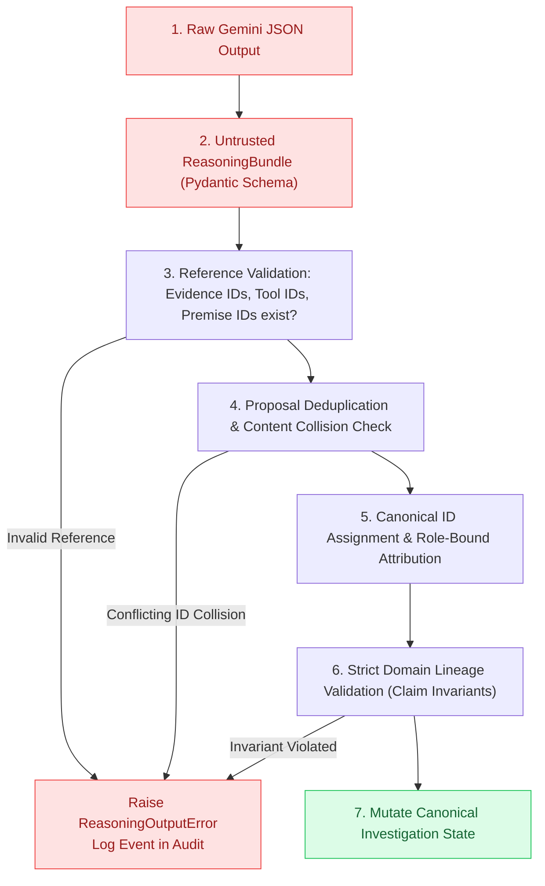

# Chapter 06 — From Model Output to Trusted State

## Why Not Deserialize LLM JSON Directly into Canonical State?

A common temptation when using Gemini with structured outputs is to deserialize the JSON directly into production domain entities:

```python
# DANGEROUS PATTERN:
raw_json = gemini.generate_content(prompt)
investigation = Investigation.model_validate_json(raw_json)  # TRUST VIOLATION!
```

Why is this unacceptable in enterprise systems?
1. **Unbounded ID Generation**: The LLM might hallucinate non-existent evidence IDs (e.g. citing `"evidence-sec-999"` which was never ingested).
2. **Fabricated Tool Lineage**: The model might claim that a number was calculated by `"tool-execution-quantum-supercalc"`.
3. **Role Confusion**: An agent might propose a claim with the author set to `"CHIEF_RISK_OFFICER"` or `"BOARD_OF_DIRECTORS"`.
4. **Circular / Broken Premises**: An investigator recommendation might reference premises that don't exist.

> [!IMPORTANT]
> **All model outputs are untrusted proposals until validated against the canonical reality of the investigation.**

---

## The Trust Boundary Pipeline

The `ReasoningStateAdapter` in [`src/institutional_risk_fleet/reasoning_adapter.py`](file:///Users/xq/Documents/GitHub/institutional-risk-agent-fleet/src/institutional_risk_fleet/reasoning_adapter.py) acts as a strict firewall:



---

## 1. Reference Validation: Enforcing Reality

Before modifying a single field of state, the adapter runs `_validate_references` ([`src/institutional_risk_fleet/reasoning_adapter.py`](file:///Users/xq/Documents/GitHub/institutional-risk-agent-fleet/src/institutional_risk_fleet/reasoning_adapter.py#L95-L135)):

```python
@staticmethod
def _validate_references(investigation: Investigation, outcome: ProviderOutcome, proposals):
    evidence_ids = set(investigation.evidence)
    execution_ids = set(investigation.tool_executions)

    referenced_evidence = {
        *(item for _, proposal in proposals for item in proposal.evidence_ids),
        *(item for candidate in outcome.bundle.challenger.candidates for item in candidate.conflicting_evidence_ids),
    }
    referenced_tools = {
        *(item for _, proposal in proposals for item in proposal.tool_execution_ids),
    }

    missing_evidence = sorted(referenced_evidence - evidence_ids)
    missing_tools = sorted(referenced_tools - execution_ids)

    if missing_evidence or missing_tools:
        raise ReasoningOutputError(f"unknown provider references: evidence={missing_evidence}, tools={missing_tools}")
```

If the model references an evidence ID or tool execution ID that does not exist in `investigation.evidence` or `investigation.tool_executions`, the entire outcome is rejected.

---

## 2. Proposal Deduplication vs. Conflicting Collisions

When the downstream Investigator agent synthesizes findings, it often carries forward or aggregates proposals authored by Credit and Market.

Consider two cases:

### Case A: Harmless Redundant Proposal
The Investigator cites the exact same proposal ID with identical metric and value.
* **Resolution**: Deduplicate safely.

### Case B: Malicious or Buggy Collision
The Investigator uses an existing proposal ID (`"proposal-001"`) but assigns a completely different value or metric.
* **Resolution**: **Reject!** A naive "first-wins" deduplication strategy would silently overwrite or ignore the discrepancy.

---

## 3. The All-or-Nothing Mutation Principle

In [`src/institutional_risk_fleet/reasoning_adapter.py`](file:///Users/xq/Documents/GitHub/institutional-risk-agent-fleet/src/institutional_risk_fleet/reasoning_adapter.py#L50-L75):

```python
# No state mutation occurs until the entire provider result has passed validation:
for claim in (*claims, recommendation):
    self._add_claim(investigation, claim)

investigation.theses[thesis.id] = thesis
investigation.active_thesis_id = thesis.id
```

If any validation step fails (e.g. an invalid challenge target, an unverified tool execution, or a missing premise), zero claims are added to `investigation.claims`. State remains pristine and an audited error event is recorded.

---

## Check Your Understanding

1. **Which is safer: rejecting a malformed model output, or modifying it until it fits the schema?**
   * *Answer*: In risk systems, **rejecting** is much safer. "Auto-fixing" or guessing model intent can mask serious reasoning bugs, hallucinated premises, or security violations.
2. **When might narrow normalization still be legitimate?**
   * *Answer*: Only for deterministic formatting (e.g., stripping whitespace or converting a string float `"3.8"` to `float(3.8)`), never for inventing missing evidence IDs or altering financial values.
3. **What happens to the investigation when a model output fails validation?**
   * *Answer*: The workflow catches `ReasoningOutputError`, records `EventType.MODEL_OUTPUT_VALIDATION_FAILED` in the audit log, and marks governance as `HUMAN_REVIEW_REQUIRED`.

---

## Code-Reading Exercise

Open [`src/institutional_risk_fleet/reasoning_adapter.py`](file:///Users/xq/Documents/GitHub/institutional-risk-agent-fleet/src/institutional_risk_fleet/reasoning_adapter.py#L25-L90) and trace:
1. `apply(...)`: Look at how capability checks are enforced for both `Role.INVESTIGATOR` and `Role.CHALLENGER` via `self.gate.require(...)`.
2. Notice how canonical IDs (`claim-001`, `claim-003`, `claim-004`) are assigned deterministically to proposals.

---

## Optional Experiment

Look at `tests/test_milestone3_reasoning.py`:
* `test_unknown_reference_is_rejected_before_canonical_state()`
* `test_unknown_tool_reference_is_rejected_before_canonical_state()`
* `test_semantically_malformed_output_is_rejected_before_state()`

Run these unit tests locally:

```bash
uv run pytest tests/test_milestone3_reasoning.py -k "rejected_before"
```

Next: [Chapter 07 — Why 4.1x Fails →](07_why_4_1x_fails.md)
