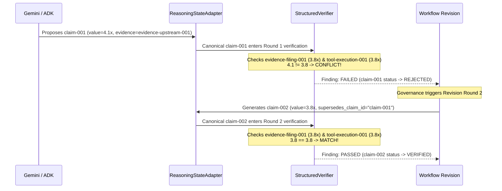

# Chapter 07 — Why 4.1x Fails: Structured Claim Verification

## The Limitations of Lexical "Verification"

Many AI verification demos perform "verification" by measuring semantic similarity or prompt-asking an LLM:

> *"Compare Sentence A: 'Acme leverage is 4.1x' with Sentence B: 'Acme leverage is 3.8x'. Do they agree?"*

Why is lexical / prompt-based verification dangerously flawed?
1. **High Semantic Overlap**: Sentences A and B have 85%+ lexical similarity and identical syntactic structure. Embeddings-based cosine similarity tools will score them as near-duplicates!
2. **Ignorance of Units & Periods**: An LLM might treat `3.8%` and `3.8x` as identical numbers, or mix up FY2024 with FY2025.
3. **Nondeterministic Judgment**: Asking an LLM to verify another LLM creates an infinite regress of probabilistic opinions with zero mathematical guarantees.

> [!IMPORTANT]
> **Verification in this system is structured, unit-aware, period-aware, and deterministic.**

---

## The Verification Step-by-Step

Let's walk through the exact lifecycle of `claim-001` vs. `claim-002`.



---

## Deep Dive: `_verify_numeric` in `verification.py`

Look at how `StructuredVerifier` evaluates numbers in [`src/institutional_risk_fleet/verification.py`](file:///Users/xq/Documents/GitHub/institutional-risk-agent-fleet/src/institutional_risk_fleet/verification.py#L166-L237):

```python
def _verify_numeric(self, investigation, claim, verification_round, tool_outputs):
    expected_values: list[float] = []
    expected_sources: list[str] = []
    unit_conflicts: list[str] = []

    # 1. Check authoritative evidence facts:
    for evidence in investigation.evidence.values():
        if not evidence.authoritative or claim.metric not in evidence.facts:
            continue
        fact = evidence.facts[claim.metric]
        if fact.period == claim.period and isinstance(fact.value, (int, float)):
            expected_values.append(float(fact.value))
            expected_sources.append(evidence.id)
            if fact.unit != claim.unit:
                unit_conflicts.append(f"{evidence.id}:{fact.unit}")

    # 2. Check deterministic tool execution outputs:
    for execution_id, output in zip(claim.tool_execution_ids, tool_outputs, strict=True):
        execution = investigation.tool_executions[execution_id]
        if isinstance(output, (int, float)):
            expected_values.append(float(output))
            expected_sources.append(execution_id)
            if execution.units != claim.unit:
                unit_conflicts.append(f"{execution_id}:{execution.units}")

    # 3. Enforce unit agreement:
    if unit_conflicts:
        return self._finding(..., FindingResult.FAILED, rationale=f"Units conflict: {unit_conflicts}")

    # 4. Enforce mathematical equality within floating-point tolerance:
    expected = expected_values[0]
    support_disagrees = any(abs(v - expected) > 1e-9 for v in expected_values[1:])
    observed = float(claim.value)
    passed = not support_disagrees and abs(observed - expected) <= 1e-9

    return self._finding(..., FindingResult.PASSED if passed else FindingResult.FAILED)
```

### Why Round 1 Fails for `claim-001`:
* **Observed Value**: `4.1` (from `evidence-upstream-001`, which has `authoritative=False`).
* **Expected Value**: `3.8` (from `evidence-filing-001`, which has `authoritative=True` and value `3.8`).
* **Result**: `abs(4.1 - 3.8) = 0.3 > 1e-9` $\rightarrow$ **`FindingResult.FAILED`**.
* **Claim Status**: `claim-001.status` is set to **`ClaimStatus.REJECTED`**.

---

## Round 2: Generating Superseding `claim-002`

When verification fails, the workflow does not erase `claim-001`. It invokes `_revise_thesis` ([`src/institutional_risk_fleet/workflow.py`](file:///Users/xq/Documents/GitHub/institutional-risk-agent-fleet/src/institutional_risk_fleet/workflow.py#L225-L275)):

```python
# 1. Create revised claim citing authoritative sources:
revised_leverage_claim = Claim(
    id="claim-002",
    author=Role.CREDIT,
    claim_type=ClaimType.CALCULATED,
    text="Acme FY2025 gross leverage is 3.8x.",
    metric="fy2025_leverage",
    value=3.8,
    unit="x",
    period="FY2025",
    evidence_ids=("evidence-filing-001",),
    tool_execution_ids=("tool-execution-001",),
    confidence=1.0,
    supersedes_claim_id="claim-001",  # Explicit audit link!
)

# 2. Add to canonical state:
investigation.claims["claim-002"] = revised_leverage_claim
```

In Round 2:
* `active_claims()` returns `claim-002` (and skips superseded `claim-001`).
* `_verify_numeric()` observes `3.8` against expected `3.8` $\rightarrow$ **`PASSED`**!

---

## Check Your Understanding

Consider the following three scenarios. Predict what the `StructuredVerifier` will do:

### Case 1:
* Claim: `metric="fy2025_leverage"`, `value=3.8`, `unit="x"`, `period="FY2025"`.
* Authoritative 10-K Evidence: `value=3.8`, `unit="x"`, `period="FY2025"`.

### Case 2:
* Claim: `metric="fy2025_leverage"`, `value=3.8`, `unit="%"`, `period="FY2025"`.
* Authoritative 10-K Evidence: `value=3.8`, `unit="x"`, `period="FY2025"`.

### Case 3:
* Claim: `metric="fy2025_leverage"`, `value=4.1`, `unit="x"`, `period="FY2025"`, citing `evidence_ids=("evidence-filing-001",)`.

<details>
<summary><b>Click to reveal answers & explanations</b></summary>

1. **Case 1 $\rightarrow$ PASSED**: Metric, value, unit, and period all match within tolerance.
2. **Case 2 $\rightarrow$ FAILED (`check_type="numeric_units"`)**: Units disagree (`%` vs `x`). In credit analysis, 3.8% is very different from 3.8x debt-to-EBITDA.
3. **Case 3 $\rightarrow$ FAILED (`check_type="numeric_consistency"`)**: Even though the claim cited the authoritative filing ID, its observed value (`4.1`) disagrees with the filing's recorded fact (`3.8`). Citing an ID does not give the model license to invent numbers.
</details>

---

## Code-Reading Exercise

Open [`src/institutional_risk_fleet/verification.py`](file:///Users/xq/Documents/GitHub/institutional-risk-agent-fleet/src/institutional_risk_fleet/verification.py#L21-L35) and inspect `active_claims(investigation)`:
* Notice how it builds the `superseded` set of claim IDs and filters them out so that Round 2 only evaluates active, un-superseded claims.

---

## Optional Experiment

Run the verification test suite:

```bash
uv run pytest tests/test_milestone2_verification.py
```

Next: [Chapter 08 — Governance and the Human Gate →](08_governance_and_the_human_gate.md)
