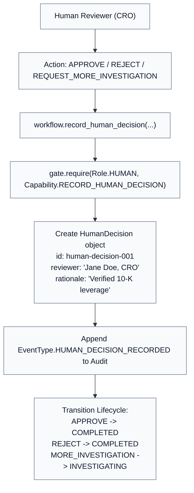

# Chapter 08 — Governance and the Human Gate

## The Crucial Distinction

In novice agent architectures, when all automated checks pass, the system automatically executes the final action:

```text
Flawed Assumption:
All tests & verifications pass  ==>  Action is automatically approved & executed
```

In institutional risk, this assumption is completely false:

> **Machine verification passing simply means the numbers are factually correct. It does NOT mean the institution has decided to accept the risk.**

---

## The Four Independent State Dimensions

Look at how [`src/institutional_risk_fleet/domain.py`](file:///Users/xq/Documents/GitHub/institutional-risk-agent-fleet/src/institutional_risk_fleet/domain.py#L40-L100) separates risk evaluation into 4 orthogonal dimensions:

```text
┌──────────────────────────────────────────────────────────┐
│ 1. LifecycleStatus:                                      │
│    CREATED → INVESTIGATING → VERIFYING →                 │
│    REVISING → AWAITING_HUMAN_REVIEW → COMPLETED          │
├──────────────────────────────────────────────────────────┤
│ 2. GovernanceStatus:                                     │
│    CLEAR | REVISION_REQUIRED | HUMAN_REVIEW_REQUIRED    │
├──────────────────────────────────────────────────────────┤
│ 3. RiskClassification:                                   │
│    GREEN | AMBER | RED                                   │
├──────────────────────────────────────────────────────────┤
│ 4. HumanReviewStatus:                                    │
│    NOT_REQUIRED | REQUIRED | APPROVED |                  │
│    REJECTED | ESCALATED                                  │
└──────────────────────────────────────────────────────────┘
```

---

## The Policy Evaluation in `governance.py`

Inspect `evaluate_investigation` in [`src/institutional_risk_fleet/governance.py`](file:///Users/xq/Documents/GitHub/institutional-risk-agent-fleet/src/institutional_risk_fleet/governance.py#L25-L95):

```python
def evaluate_investigation(investigation: Investigation) -> GovernanceDecision:
    # 1. Did all active claims pass verification?
    all_findings_passed = all(
        finding.result == FindingResult.PASSED
        for finding in investigation.verification_findings
        if finding.verification_round == investigation.revision_count + 1
    )

    # 2. If claims failed, force revision:
    if not all_findings_passed:
        return GovernanceDecision(
            status=GovernanceStatus.REVISION_REQUIRED,
            machine_verification_passed=False,
            human_review_required=False,
            ...
        )

    # 3. If claims passed, evaluate institutional risk policies:
    triggered_rules = []
    if investigation.event.severity == Severity.HIGH:
        triggered_rules.append("high_severity_event")
    if investigation.event.portfolio_exposure_usd >= 50_000_000:
        triggered_rules.append("exposure_exceeds_50m_threshold")

    risk_classification = RiskClassification.RED if triggered_rules else RiskClassification.GREEN
    human_required = bool(triggered_rules)

    return GovernanceDecision(
        status=GovernanceStatus.HUMAN_REVIEW_REQUIRED if human_required else GovernanceStatus.CLEAR,
        machine_verification_passed=True,
        risk_classification=risk_classification,
        human_review_required=human_required,
        triggered_rules=tuple(triggered_rules),
    )
```

Notice what happens after Round 2:
1. `machine_verification_passed` is **`True`** (The leverage claim is 3.8x, spread move is 90 bps, P&L is -\$2.835m).
2. Because severity is `HIGH` and exposure is `\$75,000,000 >= \$50,000,000`, the rules `"high_severity_event"` and `"exposure_exceeds_50m_threshold"` trigger.
3. Risk is classified as **`RED`**.
4. Governance returns **`HUMAN_REVIEW_REQUIRED`**.
5. Lifecycle transitions to **`AWAITING_HUMAN_REVIEW`**.

---

## Enforcing the Human Gate

How does code prevent an unreviewed investigation from completing?

Inspect `complete_investigation` in [`src/institutional_risk_fleet/workflow.py`](file:///Users/xq/Documents/GitHub/institutional-risk-agent-fleet/src/institutional_risk_fleet/workflow.py#L320-L340):

```python
def complete_investigation(self, investigation: Investigation) -> Investigation:
    if investigation.human_review_status == HumanReviewStatus.REQUIRED:
        raise ValueError(
            "cannot complete investigation: human review is required before completion"
        )
    # Only transitions to COMPLETED when human decision is recorded!
```

---

## Recording an Explicit Human Decision

When an authorized human reviewer logs into the UI or submits via API, `record_human_decision` executes ([`src/institutional_risk_fleet/workflow.py`](file:///Users/xq/Documents/GitHub/institutional-risk-agent-fleet/src/institutional_risk_fleet/workflow.py#L280-L315)):



---

## Check Your Understanding

1. **Why is `HUMAN_REVIEW_REQUIRED` a governance result rather than a model prediction?**
   * *Answer*: Regulatory and institutional policies dictate when humans must be in the loop based on capital exposure thresholds and risk severity, not based on whether an LLM thinks a human should look at it.
2. **What happens if a human reviewer chooses `REQUEST_MORE_INVESTIGATION`?**
   * *Answer*: The lifecycle transitions back from `AWAITING_HUMAN_REVIEW` to `INVESTIGATING`, allowing the fleet to gather additional data or explore alternative hypotheses.

---

## Code-Reading Exercise

Open [`src/institutional_risk_fleet/transitions.py`](file:///Users/xq/Documents/GitHub/institutional-risk-agent-fleet/src/institutional_risk_fleet/transitions.py#L20-L65) and inspect `VALID_TRANSITIONS`:
* Notice that `AWAITING_HUMAN_REVIEW` can only legally transition to `INVESTIGATING` (if more work requested) or `COMPLETED` (if approved/rejected). Any other transition raises `InvalidStateTransitionError`.

---

## Optional Experiment

Test completing an investigation without human review in Python:

```python
from institutional_risk_fleet.workflow import DeterministicRiskWorkflow
from institutional_risk_fleet.scenario import load_default_scenario

workflow = DeterministicRiskWorkflow()
inv = workflow.run(load_default_scenario())

try:
    workflow.complete_investigation(inv)
except ValueError as e:
    print("Caught expected block:", e)
```

Next: [Chapter 09 — Pub/Sub and Idempotency →](09_pubsub_and_idempotency.md)
