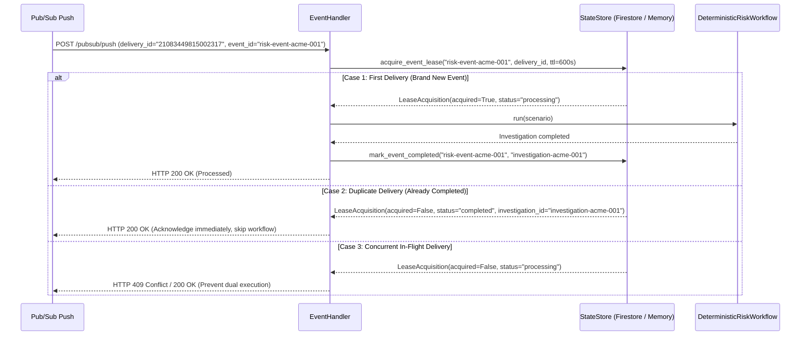

# Chapter 09 — Pub/Sub and Idempotency

## Why Real Distributed Systems Need Idempotency

Google Cloud Pub/Sub guarantees **at-least-once delivery**. In the real cloud:
* A worker might process a message but experience a network timeout right before acknowledging it.
* A Cloud Run auto-scaler might route the same message to two concurrent container instances.
* Upstream systems might retry a network publish on transient error.

If your risk agent fleet is not **idempotent**, a duplicate delivery could:
1. Spawn two duplicate investigation records for the same market shock.
2. Trigger two expensive live Gemini 3.7 Flash reasoning runs in parallel.
3. Overwrite or fork the audit timeline.

> [!IMPORTANT]
> **"Exactly-once" processing is an illusion at the message broker level; it must be achieved via transactional idempotency leases in the application storage layer.**

---

## The Event Receipt Lease Protocol

The fleet implements transactional event receipt management in [`src/institutional_risk_fleet/store.py`](file:///Users/xq/Documents/GitHub/institutional-risk-agent-fleet/src/institutional_risk_fleet/store.py) and [`src/institutional_risk_fleet/firestore_store.py`](file:///Users/xq/Documents/GitHub/institutional-risk-agent-fleet/src/institutional_risk_fleet/firestore_store.py):



---

## Inspecting the Receipt Logic in Code

Look at `handle_risk_event` in [`src/institutional_risk_fleet/event_handler.py`](file:///Users/xq/Documents/GitHub/institutional-risk-agent-fleet/src/institutional_risk_fleet/event_handler.py#L30-L75):

```python
def handle_risk_event(self, envelope: RiskEventEnvelope, delivery_id: str | None = None) -> EventHandlerResult:
    lease = self.store.acquire_event_lease(
        event_id=envelope.event_id,
        delivery_id=delivery_id or "local-delivery",
        lease_seconds=self.lease_seconds,
    )
    if not lease.acquired:
        if lease.status == "completed" and lease.investigation_id:
            existing = self.store.get(lease.investigation_id)
            return EventHandlerResult(
                investigation=existing,
                duplicate=True,
                status="completed",
                action_taken="reused_existing_investigation",
            )
        return EventHandlerResult(
            investigation=None,
            duplicate=True,
            status=lease.status,
            action_taken="lease_active_no_op",
        )

    # First time: Run workflow
    investigation = self.workflow.run(scenario)
    self.store.mark_event_completed(envelope.event_id, investigation.id)
    return EventHandlerResult(investigation=investigation, duplicate=False, status="completed")
```

---

## Strict Domain Payloads vs. Tolerant Cloud Envelopes

A subtle engineering lesson: **Where should schemas be strict vs. tolerant?**

In [`src/institutional_risk_fleet/cloud_api.py`](file:///Users/xq/Documents/GitHub/institutional-risk-agent-fleet/src/institutional_risk_fleet/cloud_api.py#L25-L45):

```python
class PubSubMessage(BaseModel):
    model_config = ConfigDict(extra="ignore", populate_by_name=True)
    data: str
    message_id: str = Field(alias="messageId", default="")
    publish_time: str | None = Field(alias="publishTime", default=None)
    attributes: dict[str, str] = Field(default_factory=dict)
```

1. **Transport Layer (`PubSubMessage`)**: Uses `extra="ignore"` to tolerate Google Cloud infrastructure metadata fields (like `publishTime`, `attributes`, trace IDs).
2. **Domain Layer (`RiskEventEnvelope`)**: Strict validation. Transport headers and attributes **cannot** override domain scenario parameters or bypass verification.

---

## Check Your Understanding

1. **Why is "exactly once" usually implemented as idempotent processing rather than assuming the broker never redelivers?**
   * *Answer*: Network partitions and distributed node crashes make physical message deduplication impossible across all failure modes. Idempotent processing ensures that redelivery causes zero side effects.
2. **Why must the event lease expire (TTL = 600s) if a worker crashes during execution?**
   * *Answer*: If a container crashes midway, a permanent lease would lock the event forever. A TTL allows a subsequent redelivery to re-acquire the lease and complete the investigation.

---

## Code-Reading Exercise

Open [`src/institutional_risk_fleet/firestore_store.py`](file:///Users/xq/Documents/GitHub/institutional-risk-agent-fleet/src/institutional_risk_fleet/firestore_store.py#L110-L155) and inspect `acquire_event_lease(...)`:
* Notice how it uses a Firestore Transaction (`@firestore.transactional`) to atomically check and set the receipt document.

---

## Optional Experiment

Run the automated duplicate-delivery test suite:

```bash
uv run pytest tests/test_milestone5_cloud.py -k "duplicate"
```

Next: [Chapter 10 — Firestore and Persistence →](10_firestore_and_persistence.md)
