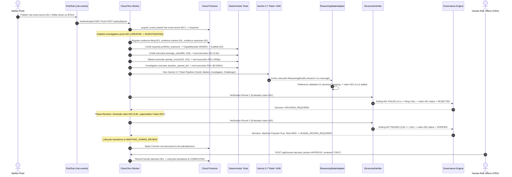

# Chapter 12 — End-to-End System Trace

## Stitching It All Together: The Lifecycle of `risk-event-acme-001`

Let's trace the complete journey of a single risk event through every layer of the architecture, with exact object IDs, domain types, and state transitions.

---

## The Complete Sequence Diagram



---

## The 19-Step Trace Breakdown

1. **Pub/Sub Publish**: Market feed publishes JSON payload for `risk-event-acme-001`.
2. **Idempotency Check**: `EventHandler` transactional lease is acquired in `event_receipts/risk-event-acme-001`.
3. **Investigation Initialization**: `investigation-acme-001` created in `CREATED` status and transitions to `INVESTIGATING`.
4. **Evidence Registration**: Three evidence objects are registered (`evidence-filing-001` [authoritative], `evidence-market-001` [authoritative], `evidence-upstream-001` [unauthoritative]).
5. **Credit Permission Denial**: Credit Agent attempts `portfolio_exposure`. `CapabilityGate` raises `PermissionDenied` and logs `permission_denied` at audit sequence `[15]`.
6. **Deterministic Leverage Tool**: Credit Agent executes `leverage_ratio` $\rightarrow$ `tool-execution-001` (`output=3.8`, `unit="x"`).
7. **Deterministic Spread Tool**: Market Agent executes `spread_move` $\rightarrow$ `tool-execution-002` (`output=90.0`, `unit="bps"`).
8. **Deterministic Portfolio Tools**: Investigator executes `portfolio_exposure` (`$75m`) and `duration_spread_pnl` $\rightarrow$ `tool-execution-004` (`-$2,835,000 USD`).
9. **ADK Gemini Reasoning**: Google ADK invokes `gemini-3.7-flash` across Credit, Market, Investigator, and Challenger roles.
10. **State Adapter Trust Boundary**: `ReasoningStateAdapter` validates that all evidence IDs, tool IDs, and premise references exist in canonical state.
11. **Canonical Claim Insertion**: `claim-001` (4.1x leverage) is registered in `investigation.claims`.
12. **Round 1 Verification**: `StructuredVerifier` compares `claim-001` (4.1x) with 10-K filing `evidence-filing-001` (3.8x). Finding fails (`FindingResult.FAILED`), marking `claim-001` as `REJECTED`.
13. **Governance Round 1**: Evaluates `machine_verification_passed=False` $\rightarrow$ sets `GovernanceStatus.REVISION_REQUIRED`.
14. **Thesis Revision**: Workflow creates `claim-002` (3.8x, `supersedes_claim_id="claim-001"`).
15. **Round 2 Verification**: `StructuredVerifier` compares `claim-002` (3.8x) with filing (3.8x) $\rightarrow$ `FindingResult.PASSED`, marking `claim-002` as `VERIFIED`.
16. **Governance Round 2**: Evaluates `machine_verification_passed=True`, but triggers rules `"high_severity_event"` and `"exposure_exceeds_50m_threshold"`. Sets `RiskClassification.RED` and `GovernanceStatus.HUMAN_REVIEW_REQUIRED`.
17. **Awaiting Human Gate**: Workflow sets `LifecycleStatus.AWAITING_HUMAN_REVIEW` and halts.
18. **Atomic Firestore Persistence**: The complete investigation root, 8 subcollections, and 70+ audit events are committed to Firestore.
19. **Human Sign-Off**: The human Chief Risk Officer reviews the Streamlit UI and approves. `record_human_decision` appends `human-decision-001` and transitions lifecycle to `COMPLETED`.

---

## What This Project is Really Demonstrating

When people build multi-agent systems, they often focus on agent personality prompts, recursive auto-gen chatter, or infinite tool-calling loops.

In an institutional enterprise setting, the critical engineering problem is completely different:

> **The interesting engineering problem is NOT how to make many AI agents talk to each other. It is how to create a reliable, mathematical, auditable boundary between probabilistic reasoning and institutional authority.**

### The Core Architectural Lessons:
1. **AI Proposes, Determinism Decides**: LLMs are creative reasoning engines; deterministic Python enforces security, arithmetic, and policy.
2. **Immutable Audit Provenance**: Rejection is a first-class state transition. Never overwrite errors in place.
3. **Defense in Depth**: Permissions enforced in code (`CapabilityGate`), claims verified by arithmetic (`StructuredVerifier`), and capital protected by an explicit human gate (`AWAITING_HUMAN_REVIEW`).

---

## Check Your Understanding

1. **Why does `investigation-acme-001` contain both `claim-001` (4.1x) and `claim-002` (3.8x) in Firestore?**
   * *Answer*: To preserve a full audit trail showing that the upstream conflict was identified, formally rejected by machine verification, and repaired before human review.
2. **What happens if a duplicate message is received after step 18?**
   * *Answer*: The event handler checks `event_receipts/risk-event-acme-001`, detects status `completed`, and returns HTTP 200 OK immediately without repeating any reasoning or tool executions.

---

## Final Hands-On Verification

Run the complete automated test suite to verify that every invariant discussed in this tutorial holds:

```bash
uv run pytest
uv run ruff check .
uv run pyright
```

Congratulations! You have completed the **Institutional Risk Agent Fleet** technical tutorial.
